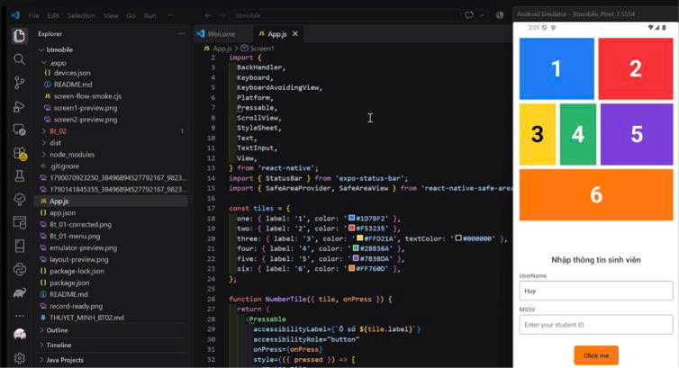

# BT-03 Mobile App

Bài tập React Native sử dụng Expo: chuyển giữa hai màn hình, truyền thông tin sinh viên và kiểm tra dữ liệu nhập.

## Video thuyết trình

[Xem video thuyết trình và demo trên Google Drive](https://drive.google.com/file/d/1NGJVFJLQZdmZ20K_q_uvQhT2m_Y84WR7/view?usp=sharing)

## BT làm thêm

[Xem video BT làm thêm trên Google Drive](https://drive.google.com/file/d/17TMwpzhBCBPNBVLtBYwJHQ79rDBeIHX7/view?usp=sharing)

Yêu cầu bổ sung: kiểm tra MSSV bắt đầu bằng `B/b`, tiếp theo đúng 2 chữ cái `A–Z` và ít nhất 1 chữ số, ví dụ `BIT240115`. Sai định dạng sẽ báo lỗi và chặn chuyển sang Screen 2.

## Hình ảnh minh chứng

Code React Native trong `App.js` và Screen 1 chạy trên máy ảo Android:



## Chức năng

- **Screen 1:** sáu ô màu đánh số 1–6, hai ô nhập `UserName`, `MSSV` và nút **Click me** ở dưới giữa màn hình.
- **Kiểm tra dữ liệu:** hai ô không được để trống hoặc chỉ chứa dấu cách. Lỗi hiển thị dưới từng ô; con trỏ chuyển đến ô cần bổ sung.
- **Định dạng MSSV:** bắt đầu bằng `B`, tiếp theo đúng 2 chữ cái từ `A–Z`, rồi ít nhất 1 chữ số từ `0–9`, ví dụ `BIT240115`. Chấp nhận cả chữ hoa và chữ thường; phần số không giới hạn độ dài.
- **Screen 2:** hiển thị tên và MSSV đã nhập, bỏ dấu cách ở đầu và cuối.
- **Quay lại:** mũi tên đen ở góc trên trái hoặc nút Back của Android đưa về Screen 1, giữ lại dữ liệu nhập.
- Giao diện có thể cuộn và hỗ trợ hiển thị khi bàn phím mở.

## Chạy ứng dụng

Cần có Node.js và npm. Mở terminal tại thư mục project:

```bash
npm ci
npm start
```

- Quét QR bằng Expo Go tương thích với Expo SDK 53 trên Android.
- Nhấn `a` để mở trên máy ảo Android khi đã cài Android SDK và khởi động máy ảo.
- Nhấn `w` để chạy trên trình duyệt.
- Nếu PowerShell chặn `npm.ps1`, dùng `npm.cmd ci` và `npm.cmd start`.

## Code chính

Toàn bộ giao diện và logic nằm trong [App.js](./App.js):

- `tiles`, `NumberTile`: khai báo màu và hiển thị các ô số có phản hồi khi bấm.
- `Screen1`: bố cục ô màu, form nhập thông tin và nút chuyển màn hình.
- `handleSubmit`: dùng `trim()`, kiểm tra hai trường bắt buộc và regex `/^B[A-Z]{2}[0-9]+$/i` cho MSSV trước khi chuyển màn hình.
- `Screen2`: nhận dữ liệu qua props `student`, hiển thị thông tin và nút quay lại.
- `App`: dùng `useState` lưu dữ liệu, chọn màn hình; `useEffect` xử lý nút Back của Android.
- `StyleSheet.create`: định nghĩa màu sắc, kích thước, khoảng cách và bố cục Flexbox.

Các file còn lại: `app.json` cấu hình Expo, `package.json` khai báo thư viện và lệnh chạy, `package-lock.json` cố định phiên bản các thư viện.
